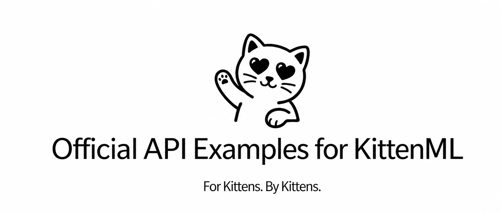
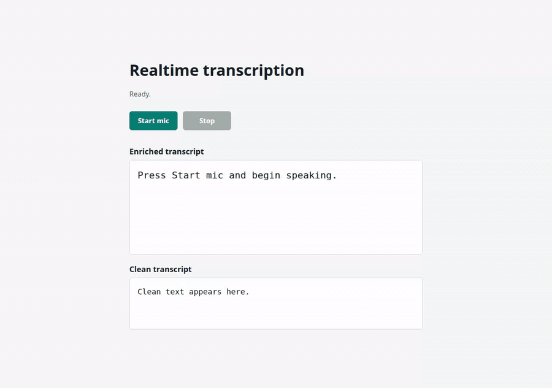
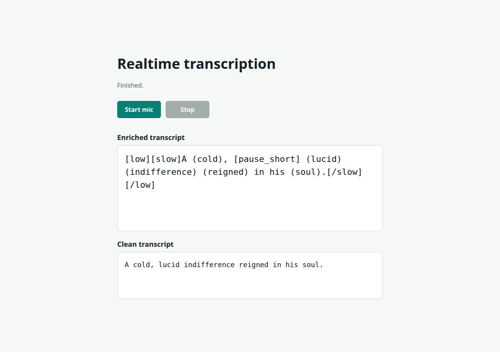

# KittenML API examples

<p align="center">
  
</p>

<p align="center">
  Small models, expressive speech, runnable code.
  <br />
  Generate and stream speech, then transcribe files and microphones, with one API.
</p>

<p align="center">
  <a href="https://docs.kittenml.com/"></a>
  <a href="https://api.kittenml.com/"></a>
  <a href="https://discord.com/invite/VJ86W4SURW"></a>
  <a href="https://kittenml.com/"></a>
  <a href="LICENSE"></a>
</p>

> These are public API examples. Keep permanent API keys in server-side secrets;
> never commit a key or place one in browser JavaScript.

---

## What is in this repository?

KittenML API examples are small, focused programs you can copy into an
application.

**Text to speech**

- **Complete and streaming TTS** — generate MP3, WAV, FLAC, AAC, Opus, or PCM, as one response or as it is generated.
- **Input-streaming TTS** — send text fragments and receive PCM over one WebSocket.
- **Voice discovery** — list the Kitten TTS 2 voices, their languages, and your saved and shared voices.
- **Decoding controls** — compare the Kitten TTS 2 `stable` and `expressive` presets.
- **Voice cloning** — one-request references and saved voices are covered in the [cloning guide](https://docs.kittenml.com/tts/custom-voices).

**Speech to text**

- **Upload STT** — send MP3, WAV, FLAC, M4A, MP4, OGG, or WebM and receive a transcript.
- **Realtime STT** — send PCM audio over WebSocket and receive provisional and final text.
- **Browser STT** — stream a microphone over WebRTC without exposing a permanent API key.
- **Emotion-aware results** — read KittenML fields such as `enriched_text`, `accent`, and `tags`.

Every directory includes its own setup steps and expected output. Clone it,
run it, change it, and break it—that is usually the fastest way to learn an API.

---

## API

The public API uses one hostname:

```text
https://api.kittenml.com
```

| Protocol | Route | Use it for |
| --- | --- | --- |
| HTTPS | `POST /v1/audio/speech` | Generate complete audio or stream its output |
| WebSocket | `WSS /v1/tts/realtime` | Send incremental text and receive PCM audio |
| HTTPS | `GET /v1/voices?model=kitten-tts-2-latest` | List Kitten TTS 2 voices and your saved and shared voices |
| HTTPS | `POST /v1/audio/transcriptions` | Transcribe a complete audio file |
| WebSocket | `WSS /v1/realtime` | Stream PCM and receive partial transcripts |
| WebRTC | `POST /v1/realtime/client_secrets`, then `POST /v1/realtime/calls` | Stream a browser microphone |

The HTTP routes support the common OpenAI SDK workflows shown here. Realtime
STT uses the canonical OpenAI `/v1/realtime` route and transcription events.

---

## Quick start

### 1. Set your API key

Create a key in the
[KittenML Platform](https://platform.kittenml.com/developers/api-keys), then
export it in your shell:

```bash
export KITTENML_API_KEY="sk_kitten_live_..."
```

The key needs `tts:generate` for TTS and `asr:transcribe` for STT.

### 2. Generate speech

```bash
# Save binary audio to a file instead of printing MP3 bytes in the terminal.
curl -L --fail-with-body -sS \
  https://api.kittenml.com/v1/audio/speech \
  -H "Authorization: Bearer $KITTENML_API_KEY" \
  -H "Content-Type: application/json" \
  --data '{
    "model": "kitten-tts-2-latest",
    "input": "Hello from the KittenML API.",
    "voice": "eleanor_somber_female_32",
    "response_format": "mp3",
    "speed": 1.0
  }' \
  --output kitten-output.mp3
```

The command returns after the complete MP3 has been saved. Use the dedicated
streaming examples when an audio player should begin before generation
finishes.

### 3. Transcribe the included audio

```bash
curl -L --fail-with-body -sS \
  https://api.kittenml.com/v1/audio/transcriptions \
  -H "Authorization: Bearer $KITTENML_API_KEY" \
  -F "file=@stt/realtime/assets/sample.wav" \
  -F "model=kitten-asr-pro-enhanced" \
  -F "response_format=json" \
  | python3 -m json.tool
```

---

## Pick an example

| Runtime | Input | Example |
| --- | --- | --- |
| Python or Node.js | Complete text-to-speech response | [`tts/upload/`](tts/upload/) |
| Python or Node.js | Stream output from complete text | [`tts/streaming/`](tts/streaming/) |
| Python or Node.js | Stream text input and audio output | [`tts/realtime/`](tts/realtime/) |
| Python or Node.js | List available voices | [`tts/voices/`](tts/voices/) |
| Python or Node.js | Compare Kitten TTS 2 decoding presets | [`tts/controls/`](tts/controls/) |
| cURL, Python, or Node.js | Complete audio file | [`stt/upload/`](stt/upload/) |
| Python | Prerecorded PCM over WebSocket | [`stt/realtime/python`](stt/realtime/python/) |
| Node.js | Prerecorded PCM over WebSocket | [`stt/realtime/javascript`](stt/realtime/javascript/) |
| Browser + Node.js | Live microphone over WebRTC | [`stt/realtime/webrtc`](stt/realtime/webrtc/) |

A small LibriSpeech-derived sample is included, so the upload and realtime-file
examples run without sourcing audio first.

---

## Text to speech

Kitten TTS 2 and the three KittenTTS 0.8 models use the same endpoint.
For pricing, see the [KittenML platform](https://platform.kittenml.com).

| Model | Relative size | Start here when… |
| --- | ---: | --- |
| `kitten-tts-2-latest` | 1.7B parameters (ternary) | You want the latest model: 47 voices across ten languages |
| `kitten-tts-nano-0.8` | 15M parameters | You want the smallest model |
| `kitten-tts-micro-0.8` | 40M parameters | You want a balanced default |
| `kitten-tts-mini-0.8` | 80M parameters | You prioritize voice quality |

Voices belong to a model. Kitten TTS 2 voices are selected by voice ID, for
example:

```text
eleanor_somber_female_32
maeve_cozy_female_22
spanish_41
```

List all of them with `GET /v1/voices?model=kitten-tts-2-latest`, or see
[Pick a voice](tts/README.md#pick-a-voice). The three 0.8 models share eight
voices:

```text
Bella, Jasper, Luna, Bruno, Rosie, Hugo, Kiki, Leo
```

Set `stream_format` to:

- `audio` — raw encoded audio chunks, simplest for playback or saving a file.
- `sse` — Base64 `speech.audio.delta` events followed by `speech.audio.done`.

The HTTP endpoint receives complete input up front and accepts up to 40,000
characters. For text produced over time, use `WSS /v1/tts/realtime`; the engine
applies bounded buffering and streams 24 kHz PCM while input continues.

Kitten TTS 2 can also clone a voice, from reference audio sent with one request
or from a saved voice. See the
[cloning guide](https://docs.kittenml.com/tts/custom-voices).

---

## Speech to text

### See it in action

<p align="center">
  
</p>

<p align="center">
  <strong>Browser · WebRTC microphone transcription</strong><br />
  Partial emotion-aware text arrives while the microphone is active, followed
  by the authoritative clean transcript.
</p>

<details>
  <summary>View the completed browser result as a full-size image</summary>
  <p align="center">
    
  </p>
</details>

The recording above is a real run against `api.kittenml.com`, using the included
sample as a browser microphone input. Run it yourself from
[`stt/realtime/webrtc`](stt/realtime/webrtc/).

### Realtime transcription

- Send headerless mono signed PCM16 at 16 kHz or 24 kHz.
- The included WebSocket clients append paced 200 ms frames at 24 kHz.
- Send `input_audio_buffer.commit` when a manual turn is finished.
- Read provisional text from `conversation.item.input_audio_transcription.delta`.
- Replace it with the authoritative `conversation.item.input_audio_transcription.completed` result.
- Use `turn_detection: null` for explicit commits or `server_vad` for automatic turns.

Client append size and transcript cadence are separate. Sending audio every 200
ms does not guarantee one text event every 200 ms. See
[`Realtime events`](https://docs.kittenml.com/stt/realtime-events) for the
complete event fields.

The WebRTC example keeps the permanent key in `server.mjs`, gives the browser a
short-lived `ek_...` token, sends microphone media over WebRTC, and receives
transcript events on the `oai-events` data channel.

---

## Current limits

For account-backed keys, concurrency is shared by every key in the same
organization. Migrated keys that are not attached to an organization are
limited independently per key.

| Workload | Concurrent requests or sessions |
| --- | ---: |
| Streaming TTS | 2 |
| Upload STT, WebSocket STT, and WebRTC combined | 5 |

TTS HTTP requests accept up to 40,000 input characters; incremental-input TTS
sessions accept up to 262,144 cumulative characters. TTS HTTP requests time out
after 30 minutes, while input-streaming TTS sessions close after five idle
minutes or two total hours. Upload STT accepts encoded files up to 25 MiB, and
realtime STT sessions have no KittenML-enforced duration quota.

Requests above the HTTP limits return `429` with `Retry-After: 1`. An
over-limit realtime WebSocket upgrades, emits an `error` event with
`error.code: "rate_limit_exceeded"`, and closes; classify it using the event
code and retry with backoff and jitter.

---

## Requirements

- Python 3.10 or newer for Python examples.
- Node.js and npm for JavaScript and browser examples.
- cURL for command-line HTTP examples.
- FFmpeg only when converting your own compressed audio into raw realtime PCM.

---

## Documentation and support

- [API documentation](https://docs.kittenml.com/)
- [KittenML website](https://kittenml.com/)
- [Discord community](https://discord.com/invite/VJ86W4SURW)
- [GitHub issues](https://github.com/haaziq-sl/kittenml-api-examples/issues)

Test it. Break it. Roast it. When reporting a problem, include the request ID,
language, accent, and audio conditions—but never include API keys or sensitive
audio.

Happy building, kittens. ^^

## License

Apache 2.0. See [LICENSE](LICENSE).
